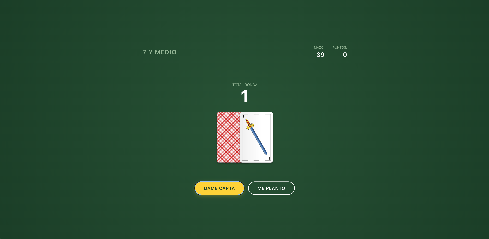

# 7 and a Half - Card Game

A web-based implementation of the classic Spanish card game "Siete y Media" (Seven and a Half).

## Project Structure

The project follows a modular architecture separating state management, game logic, and UI rendering.

```
/src
├── /game          # Core game logic (rules, point calculation)
├── /state         # State management (current score, game status)
├── /ui            # UI components and DOM manipulation
│   ├── bind*.ts   # Event listeners for buttons
│   ├── render*.ts # Functions to update the HTML
│   └── utilities.ts
├── /utilities     # General helper functions
├── main.ts        # Entry point of the application
└── style.css      # Global styles and theme
```

## How to Run

This project uses [Vite](https://vitejs.dev/) as a build tool.

1.  **Install dependencies**:
    ```bash
    npm install
    ```

2.  **Start the development server**:
    ```bash
    npm run dev
    ```

3.  **Open the game**:
    Visit the URL shown in your terminal (usually `http://localhost:5173`).

## Key Logic Decisions

- **Game Rules**: I decided to base the game on the whole deck rather than just 10 cards, so the game is more challenging and realistic. My main goal was to practica a bit more the logic side of it and improve my skills in that area. 
-   **Modular Design**: The code is split into small, single-responsibility modules. Functions are used instead of classes to keep the logic functional and simple.
- **Architecture**: I tried to follow a clean architecture pattern, separating the concerns of the application. So, I decided to create just four folders /Game /state /ui /utilities to keep the code organized and easy to maintain. 
-   **State Management**: Game state (current score, cards drawn) is kept separate from the UI logic. The UI only re-renders based on state changes.
-   **Event Binding**: User interactions (clicks) are handled in dedicated `bind` files, keeping the logic clean and decoupled from the DOM event system. This was a design pattern that I wasn't used to use, but I think it's a good way to organize the code and I wanted to try it. 

## AI Assistance

The user interface was updated with Gemini Pro, the goal was to see how it would improve the aesthetic and the user experience without investing too much time on it. I asked the AI to update the UI without changing the logic of the game and focusig just in vanilla CSS. 




